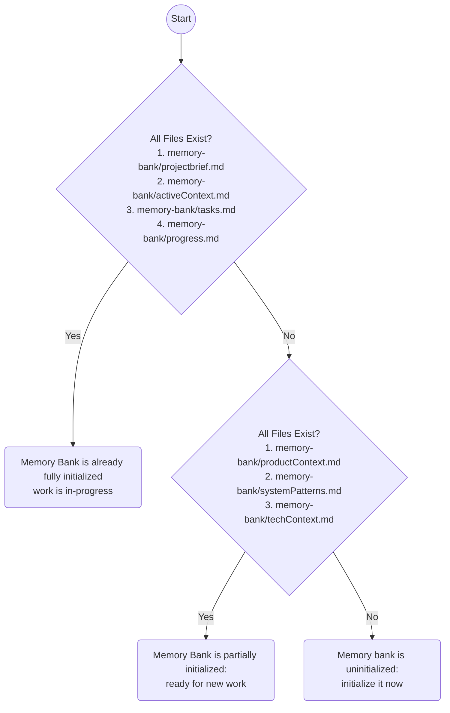

# Memory Bank Initialization & Verification



## Uninitialized

If the memory bank is completely uninitialized, the following persistent files must be created:

1. `memory-bank/productContext.md`
    * The "Product Context File" is the business context of this collection of files: target users, use cases, success criteria, constraints. If this information is not obvious from traditional documentation sources, prompt the user for more information.
    * Load: `.claude/rules/shared/niko/memory-bank/productcontext.md` and create the file by following the instructions in the rule.
2. `memory-bank/systemPatterns.md`
    * The "System Patterns File" is the architectural patterns of this collection of files: code organization, naming conventions, design patterns in use. Scan the codebase for significant patterns (nonstandard or high-criticality) and document them.
    * Load: `.claude/rules/shared/niko/memory-bank/systempatterns.md` and create the file by following the instructions in the rule.
3. `memory-bank/techContext.md`
    * The "Tech Context File" summarizes how to work with the technology stack(s) in use in the project. Identify the tools, commands, frameworks, and design system references that should be top-of-mind while working on the project. Do NOT include session-specific info (current branch, current task, local environment, etc).
    * Load: `.claude/rules/shared/niko/memory-bank/techcontext.md` and create the file by following the instructions in the rule.

Once the above files have been created, the memory bank is partially initialized, and ready for new work.

### Output to User:

```markdown
✅ **Memory Bank Initialized** - Ready for new work.
```

## Partially Initialized - Ready for New Work

Once the memory bank has been partially initialized with the persistent files and is ready for new work, the following ephemeral files must be created or updated for that work. These files will normally be created during complexity analysis and/or planning phases. In case you need to create or update one these files out-of-band, here's how:

1. `memory-bank/projectbrief.md`
    * The "Project Brief File" is the current session deliverable: user story & requirements.
    * Load: `.claude/rules/shared/niko/memory-bank/projectbrief.md` and create the file by following the instructions in the rule.
2. `memory-bank/activeContext.md`
    * The "Active Context File" is the current session focus: what's being worked on now, recent decisions, immediate next steps.
    * Load: `.claude/rules/shared/niko/memory-bank/activecontext.md` and create the file by following the instructions in the rule.
3. `memory-bank/tasks.md`
    * The "Tasks File" is the active task tracking: current task details, checklists, component lists.
    * Load: `.claude/rules/shared/niko/memory-bank/tasks.md` and create the file by following the instructions in the rule.
4. `memory-bank/progress.md`
    * The "Progress File" is the implementation progress: history of completed work and phase transitions.
    * Load: `.claude/rules/shared/niko/memory-bank/progress.md` and create the file by following the instructions in the rule.
