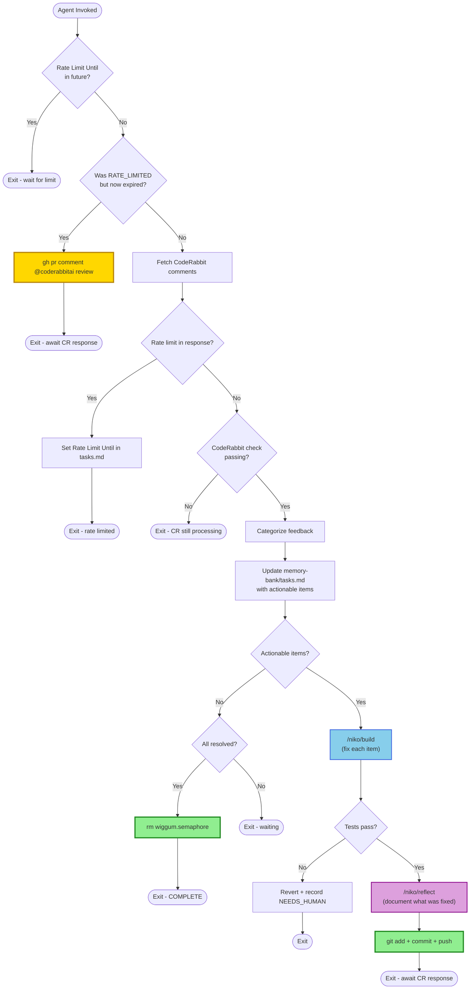

# CodeRabbit PR Wiggum Loop for Niko

## ⚠️ HEADLESS AUTOMATION - READ THIS FIRST ⚠️

**You are in a headless loop. No human is watching. No human will respond.**

- **NEVER** ask for permission, confirmation, or input
- **NEVER** say "Would you like me to..." or "Should I..."
- **NEVER** just report status - always TAKE ACTION then exit
- **IF** you fixed something and tests pass → **RUN /niko/reflect** → **COMMIT AND PUSH IMMEDIATELY**
- **IF** all feedback is resolved → **DELETE SEMAPHORE** (`rm wiggum.semaphore`)
- **IF** something needs human decision → Write to `memory-bank/tasks.md`, then exit
- **IF** you ask a question or just report without acting → You failed.

## The Loop



## Niko Integration

**This command uses Niko's memory bank and commands.** Don't reinvent the wheel.

| Phase | Niko Command | Purpose |
|-------|--------------|---------|
| Track issues | Update `memory-bank/tasks.md` | Add CodeRabbit items as checklist |
| Fix issues | `/niko/build` | Implement fixes using TDD |
| Document fixes | `/niko/reflect` | Record what was learned |

### Task File Format

Add CodeRabbit items to `memory-bank/tasks.md`:

```markdown
## Current Task: CodeRabbit PR #<number> Fixes

**Status:** In Progress | RATE_LIMITED | COMPLETE
**PR URL:** <url>
**Rate Limit Until:** <ISO timestamp or empty>

### Actionable Items
- [ ] ID: <id> - <summary>
- [x] ID: <id> - <summary> - FIXED

### Requires Human Decision
- ID: <id> - <summary> - Reason: <why>

### Ignored
- ID: <id> - <summary> - Reason: <why>
```

## Categorization

| Category | Examples | Action |
|----------|----------|--------|
| **ACTIONABLE** | Code style, error handling, types, docs, imports | `/niko/build` to fix |
| **NEEDS_HUMAN** | Architecture, API design, breaking changes, security | Record in tasks.md |
| **IGNORE** | False positives, already fixed, conflicts with standards | Skip |

## Commands

```bash
# Check CodeRabbit status
gh pr checks <number> --json name,state --jq '.[] | select(.name | test("coderabbit"; "i")) | .state'

# Trigger review after rate limit
gh pr comment <number> --body "@coderabbitai review"

# After /niko/reflect completes - commit and push
git add -A && git commit --no-gpg-sign -m "fix: address CodeRabbit feedback

<bullet points from reflection>

Generated by wiggum-niko automation" && git --no-pager push

# Completion
rm wiggum.semaphore
```

## Completion Detection

**Complete when ALL true:**
1. CodeRabbit check passing (`SUCCESS` or `PASSED`)
2. All actionable items marked FIXED in `memory-bank/tasks.md`
3. No new actionable comments since last push

**Action:** `rm wiggum.semaphore`

## Reminder

**You are a robot using Niko's brain. Act like one.**
- Issues → `/niko/build` → tests → `/niko/reflect` → push
- Done → delete semaphore
- Blocked → record in `memory-bank/tasks.md`
- EXIT

Do not report without acting. Do not ask. Execute.
