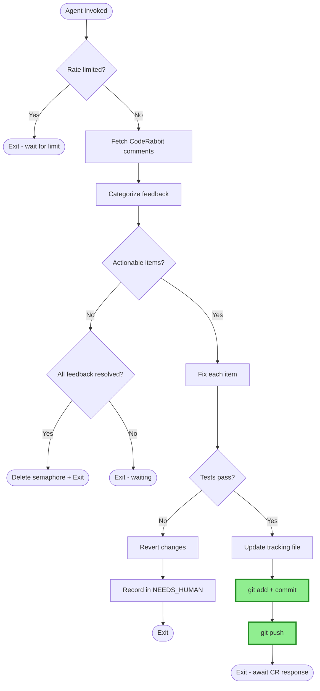

# CodeRabbit PR Wiggum - Automated PR Feedback Loop

## ⚠️ HEADLESS AUTOMATION - READ THIS FIRST ⚠️

**You are in a headless loop. No human is watching. No human will respond.**

- **NEVER** ask for permission, confirmation, or input
- **NEVER** say "Would you like me to..." or "Should I..."
- **IF** you fixed something and tests pass → **COMMIT AND PUSH IMMEDIATELY**
- **IF** something needs human decision → Write to tracking file, then exit
- **IF** you ask a question → You failed. The loop restarts and your question is lost.

## Usage

```bash
touch wiggum.semaphore
while [ -e wiggum.semaphore ]; do
  cursor agent /coderabbit-pr-wiggum <pr-url>
  sleep 300
done
```

## The Loop



**After "Tests pass" → Commit → Push is MANDATORY. No confirmation. No asking. Just do it.**

## Tracking File

Location: `memory-bank/wiggum/pr-<number>.md`

```markdown
# Wiggum: PR #<number>

## Metadata

| Field | Value |
|-------|-------|
| PR URL | <url> |
| Status | IN_PROGRESS / PUSHED_AWAITING_REVIEW / RATE_LIMITED / COMPLETE / NEEDS_HUMAN |
| Last Push | <ISO timestamp or "never"> |
| Last CodeRabbit Response | <ISO timestamp> |
| Rate Limit Until | <ISO timestamp or empty> |

## Actionable
- [ ] ID: <id> - <summary>
- [x] ID: <id> - <summary> - FIXED

## Requires Human Decision
- ID: <id> - <summary> - Reason: <why>

## Ignored
- ID: <id> - <summary> - Reason: <why>
```

## Categorization

**ACTIONABLE** (fix it):
- Code style, error handling, types, docs, imports

**NEEDS_HUMAN** (record it, don't ask):
- Architecture, API design, breaking changes, security

**IGNORE** (skip it):
- False positives, already fixed, conflicts with project standards

## Commit Template

```bash
git add -A
git commit --no-gpg-sign -m "fix: address CodeRabbit feedback

<bullet points of what you fixed>

Generated by wiggum automation"
git --no-pager push
```

## Status Meanings

| Status | Semaphore | What to do |
|--------|-----------|------------|
| `IN_PROGRESS` | Keep | Process feedback |
| `PUSHED_AWAITING_REVIEW` | Keep | Wait for CR response (compare timestamps) |
| `RATE_LIMITED` | Keep | Wait, then `gh pr comment --body "@coderabbitai review"` |
| `COMPLETE` | **Delete** | Done - no more actionable feedback |
| `NEEDS_HUMAN` | **Delete** | Done - blocked on human decision |

## Rate Limit Detection

Look for: "please wait", "rate limit", "try again in X", "too many requests"

If detected: Parse wait time → set `Rate Limit Until` → set status `RATE_LIMITED` → exit

## Reminder

**You are a robot in a loop. Act like one.**
- Make fixes
- Run tests  
- Push if green
- Record blockers
- Exit

Do not converse. Do not ask. Do not wait. Just execute.
