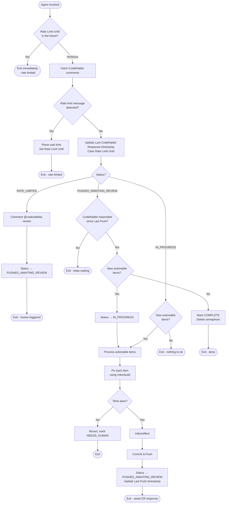

# CodeRabbit PR Wiggum - Automated PR Feedback Loop

Process CodeRabbit feedback in a loop until resolved or requires human decision.

## Usage

```bash
touch wiggum.semaphore
while [ -e wiggum.semaphore ]; do
  cursor agent /coderabbit-pr-wiggum <pr-url>
  sleep 300
done
```

## Workflow Overview



## Semaphore Contract

| Status | Semaphore | Next Action |
|--------|-----------|-------------|
| `IN_PROGRESS` | Keep | Process items or wait for new ones |
| `PUSHED_AWAITING_REVIEW` | Keep | Wait for CodeRabbit to respond |
| `RATE_LIMITED` | Keep | Wait until rate limit expires, then trigger review |
| `COMPLETE` | Delete | Loop terminates |
| `NEEDS_HUMAN` | Delete | Loop terminates |

**Key rule**: Only delete semaphore after CodeRabbit has responded to your push with no actionable feedback.

## Tracking File

Location: `memory-bank/wiggum/pr-<number>.md`

```markdown
# Wiggum: PR #<number>

## Metadata
| Field | Value |
|-------|-------|
| PR URL | <url> |
| Last Check | <ISO timestamp> |
| Last Push | <ISO timestamp or "never"> |
| Last CodeRabbit Response | <ISO timestamp> |
| Rate Limit Until | <ISO timestamp or empty> |
| Status | IN_PROGRESS / PUSHED_AWAITING_REVIEW / RATE_LIMITED / COMPLETE / NEEDS_HUMAN |

## Feedback Tracking

### Actionable
- [ ] ID: <id> - <summary> - PENDING
- [x] ID: <id> - <summary> - FIXED

### Requires Human Decision
- ID: <id> - <summary> - Reason: <why>

### Ignored
- ID: <id> - <summary> - Reason: <why>

## Fix History
### Fix 1 - <timestamp>
- Comments: <ids>
- Resolution: <summary>
- Files: <list>
```

## Phase Details

### Phase 0: Rate Limit Check (FIRST)

**Before doing anything else:**

1. Load tracking file if it exists
2. Check `Rate Limit Until` field
3. If `Rate Limit Until` is in the future:
   - Log: "Rate limited until {timestamp}, exiting"
   - **Exit immediately** (do not fetch, do not process)
4. If `Rate Limit Until` is in the past and `Status` is `RATE_LIMITED`:
   - Continue to Phase 0b (trigger review)
5. Otherwise continue to Phase 1

### Phase 0b: Trigger Review (after rate limit expires)

1. Comment on the PR to trigger CodeRabbit review:
   ```bash
   gh pr comment {number} --body "@coderabbitai review"
   ```
2. Update tracking file:
   - Clear `Rate Limit Until`
   - Set `Status` → `PUSHED_AWAITING_REVIEW`
3. **Exit** (wait for CodeRabbit to respond)

### Phase 1: Fetch & Track

1. Extract PR number from URL
2. Load or create tracking file (`mkdir -p memory-bank/wiggum`)
3. Fetch CodeRabbit comments:
   ```bash
   gh api repos/{owner}/{repo}/pulls/{number}/comments --paginate
   gh api repos/{owner}/{repo}/pulls/{number}/reviews --paginate
   ```
4. Filter for `coderabbitai[bot]` user
5. **Check for rate limit message** in most recent CodeRabbit comment:
   - Look for patterns like: "please wait", "rate limit", "try again in X minutes/hours"
   - If found: Parse wait time, set `Rate Limit Until`, set `Status` → `RATE_LIMITED`, **exit**
6. Update `Last CodeRabbit Response` to most recent comment timestamp
7. Clear `Rate Limit Until` if it was set (rate limit has passed)

### Phase 2: Categorize

**ACTIONABLE** - Auto-fixable:
- Code style, missing error handling, type issues
- Documentation gaps, import/export issues

**REQUIRES_HUMAN** - Needs decision:
- Architectural changes, API design, breaking changes
- Security-sensitive, public interface changes

**IGNORED** - Not applicable:
- False positives, already addressed, conflicts with project standards

### Phase 3: Decide

**If `RATE_LIMITED`:**
- Should not reach here (handled in Phase 0/0b)
- If somehow reached: Check `Rate Limit Until` and either exit or trigger review

**If `PUSHED_AWAITING_REVIEW`:**
- Compare `Last CodeRabbit Response` vs `Last Push`
- If CR hasn't responded yet → Exit (keep waiting)
- If CR responded → Check for new actionable items
  - None → `COMPLETE`, delete semaphore
  - Found → `IN_PROGRESS`, continue to Phase 4

**If `IN_PROGRESS`:**
- No new actionable items → Exit (idle)
- New actionable items → Continue to Phase 4
- Only NEEDS_HUMAN remain → `NEEDS_HUMAN`, delete semaphore

### Phase 4: Fix → Reflect → Push

For each actionable item:

1. **Fix** using `/niko/build` workflow (Level 1 complexity)
2. Mark as FIXED in tracking file
3. Record in Fix History

After all fixes:

4. **Test**: `pnpm test && pnpm build`
   - If fail: Revert, mark as NEEDS_HUMAN, exit
5. **Reflect**: Run `/niko/reflect` to document changes
6. **Commit & Push**:
   ```bash
   git add -A
   git commit --no-gpg-sign -m "fix: address CodeRabbit feedback

   <summary of fixes>

   Generated by wiggum automation"
   git push
   ```
7. Update tracking:
   - `Last Push` → current timestamp
   - `Status` → `PUSHED_AWAITING_REVIEW`
8. **Exit** (semaphore stays, await CR response)

## Notes

- Each fix is Level 1 complexity (small, focused)
- 5-minute sleep allows CodeRabbit time to re-analyze
- Use `--no-gpg-sign` and `--no-pager` for git commands
- "No new comments" ≠ approval (CR might still be processing)

## Rate Limit Handling

CodeRabbit may respond with rate limit messages like:
- "Please wait X minutes before requesting another review"
- "Rate limit exceeded. Try again in X hours"
- "I'm currently processing too many requests. Please try again later"

**Detection patterns** (case-insensitive):
- `please wait \d+ (minute|hour|second)`
- `rate limit`
- `try again in \d+`
- `too many requests`

**Parsing wait time:**
- Extract numeric value and unit (minutes/hours/seconds)
- Calculate `Rate Limit Until` = now + wait time
- Default to 1 hour if time cannot be parsed

**After rate limit expires:**
- Comment `@coderabbitai review` to explicitly request a new review
- This ensures CodeRabbit re-analyzes the PR after the limit clears
