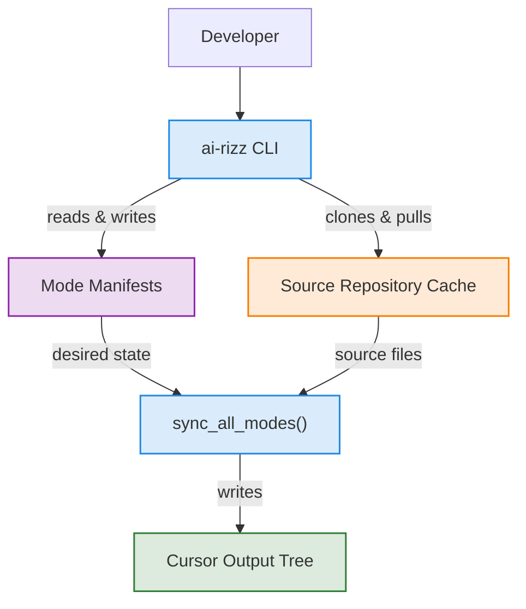
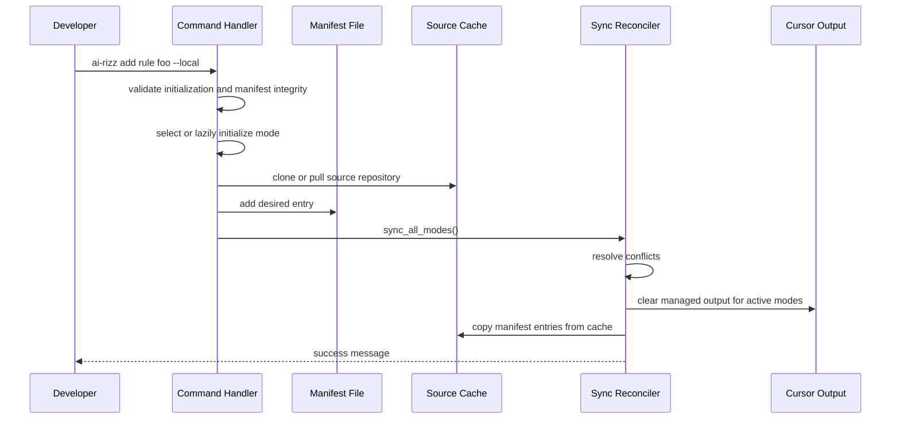
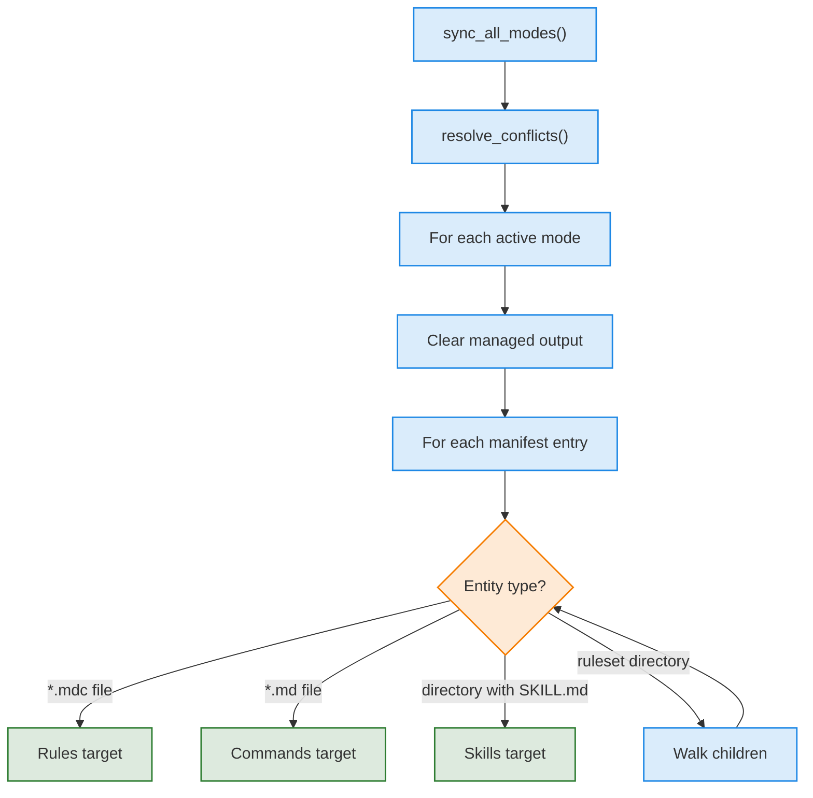

# Architecture

`ai-rizz` is a single-file POSIX shell CLI that reconciles rule repository entries into Cursor's active configuration directories.

The mental model:

1. Commands mutate **manifests**.
2. **Sync** rebuilds generated Cursor directories from those manifests.
3. The **source repository cache** is implementation detail, not user-facing state.

The rest of this page describes the cross-cutting flow. Specifics — manifest schema, cache paths, mode-specific output directories, conflict-resolution rules — live on their own pages and are linked inline.

## System Shape

- **Mode Manifests** are the durable, user-facing state. Schema and file locations: [Manifest Files](manifest.md).
- **Source Repository Cache** is a local clone that backs all reads. Layout: [Rules Cache](rules-cache.md).
- **Cursor Output Tree** is regenerated by `sync` and should be treated as deploy output. Per-mode destinations: [Rule Modes](../user-guide/rule-modes.md).

## Command Flow

Most commands follow the same shape: validate state, pick a mode, mutate a manifest, then reconcile generated files.

`add` and `remove` are intentionally manifest-first. They do not surgically edit deployed files; sync makes deployed output match the current manifests. `list` syncs the relevant cache and compares its contents against active manifests, reporting status via mode glyphs rather than inspecting generated files.

## Sync Reconciliation

`sync_all_modes()` reconciles every initialized mode. For each one, `sync_manifest_to_directory()` clears managed output and replays manifest entries through `copy_entry_to_target()`, which routes by entity type.

Two cross-cutting properties of this flow are easy to miss:

- **Commit wins on conflict.** When the same deployed filename would land from two modes, sync keeps the committed copy and drops the local one. User-facing rules: [Constraints](../user-guide/advanced/constraints.md).
- **Symlinks are followed but sandboxed.** Targets must resolve inside the source cache; out-of-repository symlinks are skipped. Detail: [Rulesets §Symlink Security](../rule-authoring/rulesets.md#symlink-security).

## Development Boundaries

The most important implementation boundary is between **desired state** (manifests) and **generated state** (Cursor output). When changing behavior, look first at the manifest mutation path and the sync path, not at ad hoc edits in generated directories.

When adding a new entity type or changing deployment behavior, expect to touch all of these areas:

- Detection and routing helpers.
- `list` display logic.
- `add` and `remove` manifest behavior.
- `copy_entry_to_target()` deployment behavior.
- Conflict resolution and sync cleanup if filenames can overlap across modes.
- Unit or integration tests, depending on whether the behavior is pure helper logic or filesystem/git behavior. See [Testing](testing.md).
