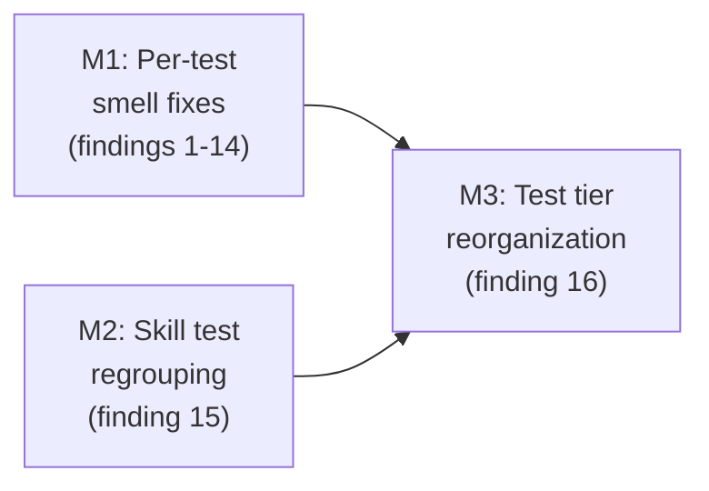

# Milestones: slobac-audit-fixes-2

## Cross-milestone invariants & constraints

These properties must hold at every milestone boundary. No milestone is permitted to violate them.

1. **Behavior coverage is preserved.** Where tests are deleted, renamed, or moved (e.g. semantic-redundancy deletions, wrong-level relocation), the equivalent product behavior must remain covered by an existing or strengthened test elsewhere in the suite.
2. **The full test suite passes.** `make test` returns 0 at the end of every milestone. No "we'll fix it in the next milestone" exits.
3. **Production code (`ai-rizz`) is not modified.** This is a test-quality project. If a test fix uncovers a real production bug, capture it as a follow-up note in the sub-run's reflection — do not fix it inside this L4.
4. **No new SLOBAC smells are introduced.** Remediations must not trade one smell for another (e.g. don't fix a `naming-lies` by adding `vacuous-assertion`s).
5. **The audit `slobac-audit-2.md` remains the source of truth.** Each milestone's reflection must explicitly account for which audit findings it closed.

## Execution Order

M1 and M2 are independent (disjoint file sets) and could be parallelized in principle; the checklist below sequences them M1 → M2 → M3 for serial execution. M3 is structural (file moves + `Makefile`/`tests/common.sh` updates) and runs last so that earlier content-level fixes happen against files at their existing paths.

## Milestones

- [ ] **M1: Remediate per-test smell findings 1-14 across 9 test files** — estimated L3. Scope: rename or strengthen 8 tests for `naming-lies`/`vacuous-assertion` (findings 2, 3, 4, 5, 8, 9, 10, 11), replace `grep ... || true` with real assertions in 3 `rotten-green` tests (findings 6, 7, 12), unconditionally assert the failure contract in 1 `conditional-logic` test (finding 1), and delete the 5 weaker semantic-redundancy duplicates from `test_command_modes.test.sh` while folding any unique intent into the canonical `test_command_sync.test.sh` / `test_ruleset_commands.test.sh` copies (findings 13, 14). Rationale for L3: many distinct files but each fix is contained; collectively spans enough files and risk surface to exceed L2.
- [ ] **M2: Regroup skill tests by durable product capability (finding 15)** — estimated L2. Scope: in `unit/test_skill_detection.test.sh`, `unit/test_skill_sync.test.sh`, and `unit/test_skill_list_display.test.sh`, replace "behavior N" plan-numbered grouping with capability-oriented groupings (e.g. detection, deployment, list rendering, cleanup, symlink security) and strip the plan-behavior numbers from comments. Rationale for L2: contained to 3 files, comment/structure refactor only, no test logic changes.
- [ ] **M3: Reorganize wrong-level tests into a real-integration tier (finding 16)** — estimated L3. Scope: design and create a new test tier (e.g. `tests/integration/functions/` or `tests/component/`) for direct-function tests that do real filesystem/git/symlink work; identify which `tests/unit/` files belong there vs. remain pure-helper unit tests; move them; update `Makefile`, `tests/run_tests.sh`, and any path assumptions in `tests/common.sh`; preserve fast-loop CI behavior. Rationale for L3: architectural — changes the project's test taxonomy convention that other contributors and CI must follow; touches build infrastructure beyond the test files themselves.
