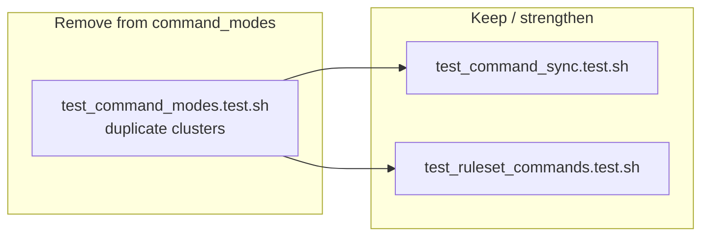

# Task: M1 — SLOBAC audit findings 1–14

* **Task ID:** `slobac-audit-fixes-2-m1`
* **Complexity:** Level 3
* **Type:** Test-suite remediation (audit-driven)

Remediate findings **1–14** from [`slobac-audit-2.md`](../../slobac-audit-2.md): strengthen or rename tests so names match assertions; replace permissive `grep ... || true` checks; delete semantically redundant tests in `test_command_modes.test.sh` while keeping canonical coverage in `test_command_sync.test.sh` and `test_ruleset_commands.test.sh`. No changes to `ai-rizz` production code.

## Pinned Info

### Redundancy resolution (findings 13–14)

Canonical copies live outside `test_command_modes.test.sh`; weaker duplicates there are deleted after folding any unique intent into the canonical tests.

## Component Analysis

### Affected Components

- **`tests/integration/`** — CLI-facing scenarios (`test_cli_add_remove`, `test_cli_init`, `test_help_and_usage`): invalid-repo handling, init mode defaults, help text completeness.
- **`tests/unit/`** — sourced `cmd_*` / harness tests: deinit modes, error handling, hook local mode, list display, ruleset management, sync operations, command modes vs sync/ruleset suites.

### Cross-Module Dependencies

- Tests rely on **`tests/common.sh`** helpers, temp dirs, and git fixtures; edits must preserve helper contracts used by adjacent tests in the same files.
- **Findings 13–14** explicitly tie `test_command_modes.test.sh` to **`test_command_sync.test.sh`** and **`test_ruleset_commands.test.sh`** — changes must be coordinated so no assertion gap appears after deletion.

### Boundary Changes

- **None** for public product API — test-only edits.

### Cross-reference — `memory-bank/systemPatterns.md`

- Remediations remain consistent with dual-manifest sync and entity routing (tests should continue to exercise real `cmd_*` paths as today; no new mocking layer required).

### Invariants & Constraints

From [`memory-bank/active/milestones.md`](milestones.md): preserve behavior coverage when deleting tests; **`make test`** passes; **do not modify** `ai-rizz`; do not introduce new SLOBAC smells.

## Open Questions

None — implementation approach is clear from prescribed remediation text in `slobac-audit-2.md`.

## Test Plan (TDD)

### Behaviors to Verify

- **Finding 1:** Invalid repository add → explicit failure or success contract asserted **without** conditional-only branches hiding the alternate path.
- **Findings 2–3:** After init with prompted mode, manifest / mode / paths reflect the selected defaulting behavior (not merely exit 0).
- **Finding 4:** Help output documents **each** required command, **or** test title matches weaker “at least one command” behavior.
- **Finding 5:** Test name matches either interactive confirmation behavior **or** `-y` fast-path cleanup behavior.
- **Finding 6:** Partial cleanup on error exposes assertable exit/status/output or filesystem state (no `grep ... || true` as sole oracle).
- **Finding 7:** Empty-repo list behavior is asserted concretely (not `grep ... || true`).
- **Findings 8–9:** Custom manifest / custom target: hook **runs** and unstages or deploys as claimed.
- **Finding 10:** Empty `commands` directory: tree slice excludes command files / matches empty-dir contract.
- **Finding 11:** Name matches upgrade-allowed behavior **or** body tests blocked downgrade.
- **Finding 12:** Missing manifest during sync: concrete warning/error/state oracle.
- **Findings 13–14:** Canonical tests in `test_command_sync.test.sh` / `test_ruleset_commands.test.sh` retain full coverage; duplicates removed from `test_command_modes.test.sh`.

### Edge Cases

- Unexpected success paths for failure-oriented tests (finding 1) must flip the test red — unconditional structure prevents silent pass.
- After deleting redundant tests, run full suite to catch ordering/fixture coupling.

### Test Infrastructure

- **Framework:** shunit2 + `tests/common.sh` (see [`memory-bank/techContext.md`](../techContext.md)).
- **Test location:** `tests/integration/`, `tests/unit/`.
- **Conventions:** `test_*()` functions; `VERBOSE_TESTS=true ./tests/unit/<suite>.test.sh` for debug.
- **New test files:** none expected.

### Integration Tests

- CLI integration files remain CLI-level; unit files remain sourced-function level — same split as today.

## Implementation Plan

### TDD encoding (test-only milestone)

All M1 “production” edits are **test file changes**. For each finding, use this order: (1) change the test so it encodes the audit-prescribed oracle (rename, stronger assertion, or — for 13–14 — identify the canonical test to rely on); (2) run the affected suite with `VERBOSE_TESTS=true ./tests/...` and confirm the intended red/green transition; (3) adjust fixtures/helpers **only under `tests/`** until green. For **findings 13–14**, explicitly confirm canonical coverage in `test_command_sync.test.sh` / `test_ruleset_commands.test.sh` **before** deleting duplicates from `test_command_modes.test.sh`; run **`make test`** after each deletion cluster.

1. **`integration/test_cli_add_remove.test.sh` — finding 1**
   - **Files:** `integration/test_cli_add_remove.test.sh`
   - **Changes:** Restructure `test_add_rule_with_invalid_repository` so expected failure **and** unexpected-success cases both assert the documented contract (exit code + stderr/message/manifest), not only inside `if [ $exit_code -ne 0 ]`.

2. **`integration/test_cli_init.test.sh` — findings 2–3**
   - **Files:** `integration/test_cli_init.test.sh`
   - **Changes:** Extend `test_init_mode_defaults` to assert created manifest name, target directory, and effective mode (or rename test + narrow comment if scope is “prompted commit only”).

3. **`integration/test_help_and_usage.test.sh` — finding 4**
   - **Files:** `integration/test_help_and_usage.test.sh`
   - **Changes:** Assert each of `init|add|remove|list|sync|deinit` (or equivalent key commands) **or** rename `test_help_mentions_key_commands` to match single-substring check.

4. **`unit/test_deinit_modes.test.sh` — findings 5–6**
   - **Files:** `unit/test_deinit_modes.test.sh`
   - **Changes:** Rename/adjust `test_deinit_confirmation_prompts` vs interactive prompts; replace `grep ... || true` in `test_deinit_partial_cleanup_on_error` with exit-code + state assertions.

5. **`unit/test_error_handling.test.sh` — finding 7**
   - **Files:** `unit/test_error_handling.test.sh`
   - **Changes:** Replace permissive grep in `test_graceful_empty_repository` with concrete empty-list / stdout contract.

6. **`unit/test_hook_based_local_mode.test.sh` — findings 8–9**
   - **Files:** `unit/test_hook_based_local_mode.test.sh`
   - **Changes:** For custom manifest and custom target scenarios: stage files, invoke hook, assert unstaged/deployed behavior — not only hook file existence.

7. **`unit/test_list_display.test.sh` — finding 10**
   - **Files:** `unit/test_list_display.test.sh`
   - **Changes:** `test_list_handles_empty_commands_directory`: assert no command entries under `commands/` (not `assertTrue ... true`).

8. **`unit/test_ruleset_management.test.sh` — finding 11**
   - **Files:** `unit/test_ruleset_management.test.sh`
   - **Changes:** Rename `test_prevent_downgrade_from_local_ruleset` to upgrade semantics **or** implement true downgrade-prevention scenario.

9. **`unit/test_sync_operations.test.sh` — finding 12**
   - **Files:** `unit/test_sync_operations.test.sh`
   - **Changes:** `test_sync_handles_missing_manifests`: assert warning/error text or durable state — remove `grep ... || true` as pass-through.

10. **`unit/test_command_sync.test.sh` & `unit/test_ruleset_commands.test.sh` & `unit/test_command_modes.test.sh` — findings 13–14**
    - **Files:** `unit/test_command_sync.test.sh`, `unit/test_ruleset_commands.test.sh`, `unit/test_command_modes.test.sh`
    - **Changes:** Delete duplicate clusters from `test_command_modes.test.sh` per audit; fold any unique “exit status / no error output” intent into canonical tests if missing; keep global ruleset-command coverage per audit note unless a stronger global test already exists elsewhere.

## Technology Validation

No new technology — validation not required.

## Challenges & Mitigations

- **Coverage loss when deleting tests (13–14):** Run `make test` after each deletion batch; compare assertion inventory against audit’s “canonical” tests.
- **Hooks/custom paths (8–9):** Higher setup cost — reuse patterns from neighboring tests in the same file for temp dirs and git state.
- **Flaky output matching (rotten-green fixes):** Prefer stable substrings / exit codes from existing CLI patterns used elsewhere in the suite.

## Preflight (2026-05-07)

- **TDD plan encoding:** PASS — ordered steps are test-file edits; explicit micro-loop above satisfies always-tdd for this milestone (no `ai-rizz` changes).
- **Convention compliance:** PASS — paths under `tests/integration/` and `tests/unit/` match `techContext.md`.
- **Dependency / conflicts:** PASS — touchpoints isolated to named suites; no duplicate utility proposals.
- **Completeness:** PASS — findings 1–14 map to steps 1–10; global ruleset rule from finding 14 called out in step 10.
- **Advisory:** Consider a one-time checklist row in the M1 reflection listing each deleted `test_command_modes` test name alongside the canonical test that subsumes it (cheap regression audit).

## Status

- [x] Component analysis complete
- [x] Open questions resolved
- [x] Test planning complete (TDD)
- [x] Implementation plan complete
- [x] Technology validation complete
- [x] Preflight
- [x] Build
- [x] QA

## QA (2026-05-07)

**Result:** PASS  

- Implementation matches the ordered plan in this file for findings 1–14; spot-checks align with `slobac-audit-2.md` prescribed remediations.
- Full suite: `make test` — all passing.
- No substantive defects requiring return to Build or Plan.
