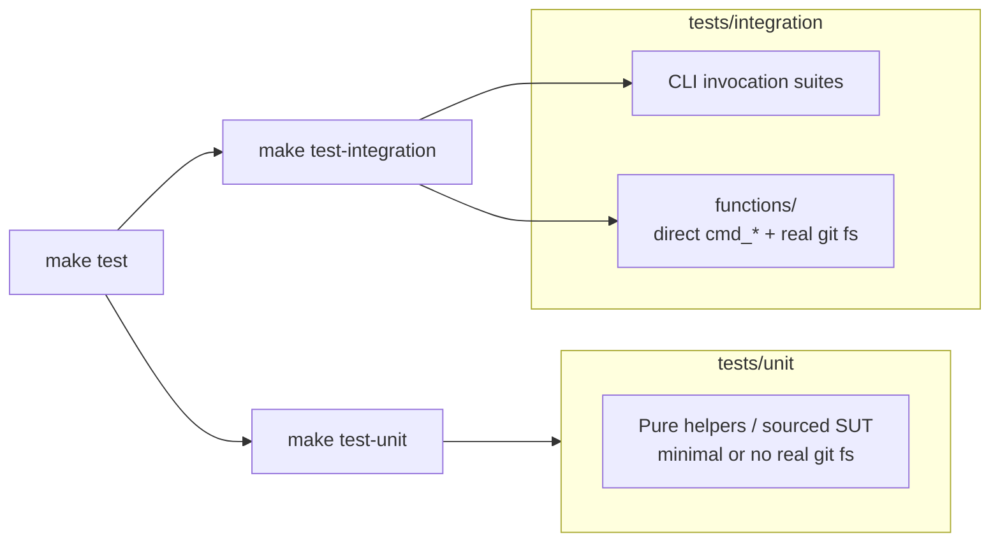

# Task: M3 — wrong-level test tier (finding 16)

* Task ID: slobac-audit-fixes-2-m3
* Complexity: Level 3
* Type: refactor (test taxonomy / layout)

Re-home tests that perform real filesystem, git, and symlink integration work out of `tests/unit/` into `tests/integration/functions/`, then align `Makefile` / `tests/run_tests.sh` / `tests/common.sh` (only if required), plus `memory-bank/techContext.md`, `memory-bank/systemPatterns.md`, `.cursor/rules/ai-rizz-development.mdc`, and `README.md`. **No edits to production `ai-rizz`.** Behavior is unchanged; every step is verified with `make test`.

## Pinned Info

### Test tier dataflow

## Component Analysis

### Affected Components

- **`tests/unit/*.test.sh`**: Some suites are mislabeled “unit” while creating temp repos, running `git`, mutating trees, or asserting on-disk deploy results (finding 16). Each candidate file is either moved wholesale to `tests/integration/functions/` or split if it mixes true unit-style cases with integration-style cases.
- **`tests/integration/functions/`** (new): Holds relocated `*.test.sh` files; same shunit2 + `tests/common.sh` sourcing pattern as today.
- **`tests/run_tests.sh`**: `find_tests` already uses `find "$PROJECT_ROOT/tests/integration" -name "*.test.sh"`, which **recurses into subdirectories** — nested `integration/functions/` suites are picked up as integration tests without changing discovery logic, unless we intentionally add ordering or explicit path lists (avoid unless needed).
- **`Makefile`**: `test-integration` delegates to `run_tests.sh --integration`; no change required unless we introduce a separate tier flag (not planned).
- **`tests/common.sh`**: Re-read after moves for any hard-coded `tests/unit` paths or assumptions about sibling layout; fix only if breaks.
- **Docs**: `memory-bank/techContext.md` (how to run single suites; unit vs integration vs functions), `memory-bank/systemPatterns.md` (record taxonomy pattern), `.cursor/rules/ai-rizz-development.mdc` (single-test example paths), `README.md` (examples consistent with real paths).

### Cross-Module Dependencies

- Relocated files still `cd` to project root and source `tests/common.sh` via paths relative to script location — **verify** each moved file’s preamble (`SCRIPT_DIR`, `. ./common.sh` or equivalent) still resolves after directory depth changes.
- Integration tests depend on `AI_RIZZ_PATH` (set by runner) — unchanged.

### Boundary Changes

- **Contributor-facing**: “Unit” means fast, minimal I/O; “integration/functions” means direct function tests with real git/fs. Public CLI behavior unchanged.

### Cross-reference `systemPatterns.md`

- Aligns with existing entity-routing patterns N/A; **append** a concise “Test suite taxonomy” pattern documenting the three buckets (unit, integration CLI, integration functions).

### Invariants & Constraints

- From `milestones.md`: preserve behavior coverage; **`make test` green** after each logical batch; **no `ai-rizz` edits**; **no new SLOBAC smells**; **`slobac-audit-2.md` finding 16** explicitly addressed in M3 reflection.

## Open Questions

None — implementation approach is clear. **Membership** of which files move is resolved by an explicit inventory step (grep/read) before any moves; audit cites `test_sync_operations.test.sh`, `test_symlink_security.test.sh`, and at least one test in `test_skill_sync.test.sh` as representatives, not an exhaustive list.

## Test Plan (TDD)

### Behaviors to Verify

- **`make test`**: full suite passes after all relocations and doc edits — same observable outcome as baseline (no behavior regression).
- **`make test-unit`**: completes without executing relocated files (they must not remain under `tests/unit/`).
- **`make test-integration`**: executes both existing `tests/integration/*.test.sh` and new `tests/integration/functions/*.test.sh` (implicit via `find`).
- **Per moved file**: same test functions run from new path (file still discoverable, helpers still source).

### Edge Cases

- Mixed files: if splitting, both resulting files must retain correct `common.sh` paths and not duplicate `setUp`/`tearDown` conflicts.
- Any test that referenced paths like `../unit/` — must be updated (inventory catches).

### Test Infrastructure

- Framework: shunit2 + `tests/common.sh` (unchanged).
- Test locations: `tests/unit/`, `tests/integration/`, new `tests/integration/functions/`.
- Conventions: `test_*.test.sh`, `test_*()` functions.
- New test files: **none** unless a split creates a new shell file (still test code, not production).

### Integration Tests

- Relocated suites **are** integration-level tests; they continue to validate `cmd_*` / sync / symlink security behavior against real temp repos.

## Implementation Plan

1. **Inventory (no file moves yet)**  
   - Files: all `tests/unit/*.test.sh`, optionally `tests/common.sh` header comments.  
   - Changes: Produce a checklist in commit message or in `tasks.md` Status notes: mark each file *stay* vs *move* vs *split*, using criteria: real `git init`/`git commit`, temp dir trees, symlink attacks, full sync-to-disk assertions → **move**; pure parsing/manifest-string/unit-isolated logic → **stay**.  
   - Verification: Document expected count of moves; no `make test` change yet.

2. **Create directory `tests/integration/functions/`**  
   - Files: new directory only (add `.gitkeep` only if empty dir would not be tracked — prefer moving first file in same commit as mkdir).  
   - Verification: `test -d tests/integration/functions`.

3. **Relocate high-confidence audit files**  
   - Files: `tests/unit/test_sync_operations.test.sh`, `tests/unit/test_symlink_security.test.sh` → `tests/integration/functions/`.  
   - Changes: Fix internal relative paths to `common.sh` if broken by depth; update any string literals embedding old paths.  
   - Verification: `make test`.

4. **Resolve `test_skill_sync.test.sh` (and any other mixed file from inventory)**  
   - Files: per inventory — either move entire `test_skill_sync.test.sh` to `functions/`, or extract filesystem-backed tests into e.g. `tests/integration/functions/test_skill_sync_fs.test.sh` leaving pure tests in `unit/`.  
   - Changes: Preserve test names where possible for grep-based debugging; no assertion logic changes unless path fixes require it.  
   - Verification: `make test`.

5. **Relocate remaining *move* candidates from inventory (batched)**  
   - Files: each remaining `tests/unit/test_*.test.sh` marked *move* in step 1.  
   - Changes: Same as step 3; batch size 1–3 files per commit if desired, always `make test` after batch.  
   - Verification: `make test` per batch.

6. **Runner / Makefile / common.sh audit**  
   - Files: `tests/run_tests.sh`, `Makefile`, `tests/common.sh`.  
   - Changes: Only if step 1–5 exposed path bugs or if we add explicit comments/help text listing `integration/functions`. Default expectation: **no `find` change**.  
   - Verification: `make test-unit` and `make test-integration` and `make test`.

7. **Documentation pass**  
   - Files: `memory-bank/techContext.md`, `memory-bank/systemPatterns.md`, `.cursor/rules/ai-rizz-development.mdc`, `README.md`.  
   - Changes: Document three-tier meaning; single-suite examples use real paths (e.g. `./tests/integration/functions/test_sync_operations.test.sh` if that file exists post-move); fix any stale README paths discovered during edit.  
   - Verification: Manual consistency read; `make test`.

8. **Final sweep**  
   - Grep for `tests/unit` references that should now point at `integration/functions`; grep for moved filenames under `unit/`.  
   - Verification: `make test`.

## Technology Validation

No new technology — validation not required.

## Challenges & Mitigations

- **Mixed-level single file**: Use inventory + split only when necessary; prefer one file per concern to avoid duplicate setup. Mitigation: read `setUp`/`tearDown` coupling before splitting.
- **Stale docs / rules**: Mitigation: explicit grep for `test_unit` paths and README examples in step 8.
- **False sense of “fast unit”**: Mitigation: `techContext.md` states clearly that `make test-unit` excludes `integration/functions/`.

## Status

- [x] Component analysis complete
- [x] Open questions resolved
- [x] Test planning complete (TDD)
- [x] Implementation plan complete
- [x] Technology validation complete
- [ ] Preflight
- [ ] Build
- [ ] QA
