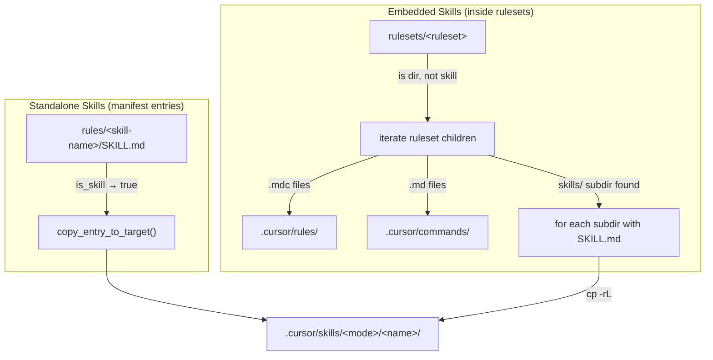

# Task: Skill Support

* Task ID: skill-support
* Complexity: Level 3
* Type: feature

Add complete skill support to ai-rizz. Skills are directories containing `SKILL.md` that get deployed to `.cursor/skills/<mode>/`. Two valid definition paths: standalone in `rules/` and embedded in a ruleset's `skills/` subdir.

## Pinned Info

### Skill Detection & Deployment Flow

Key design decisions:
- Standalone skills (`rules/<name>`) are manifest entries — `is_skill()` detects them, `copy_entry_to_target()` routes them
- Embedded skills (`rulesets/<r>/skills/<name>`) are NOT manifest entries — discovered by directory walk during ruleset processing in `copy_entry_to_target()`
- `is_skill()` also validates `rulesets/<r>/skills/<name>` paths for completeness (e.g., if `cmd_list` needs to confirm a directory is a skill)
- **NOT valid**: `rulesets/skills/<name>` (no top-level magic dir), `rulesets/<name>` symlink-to-skill (skills don't live at ruleset root)

## Component Analysis

### New Functions

- **`is_skill()`**: Detects whether a repo-relative entry is a skill. Two cases: `rules/<name>` with `SKILL.md`, and `rulesets/<r>/skills/<name>` with `SKILL.md`.
- **`get_skills_target_dir()`**: Returns `.cursor/skills/<mode>/` path, analogous to `get_commands_target_dir()`.

### Modified Functions

- **`copy_entry_to_target()` (L4287-4481)**:
  - Before the directory/ruleset branch (L4360): add standalone skill detection + routing
  - Inside the directory/ruleset branch (after L4475, .md command handling): add skills/ subdir processing
- **`cmd_list()` (L3055-3335)**:
  - After commands section (L3244): add "Available skills:" section discovering from `rules/` and `rulesets/*/skills/`
  - In ruleset tree rendering (L3300): add `skills/` as magic subdir alongside `commands/`
- **`sync_manifest_to_directory()` (L4086)**: Add skills dir clearing alongside commands dir clearing (L4126-4133)
- **Global paths** (L50-59): Add `GLOBAL_SKILLS_DIR`

### Cross-Module Dependencies

- `copy_entry_to_target()` → `is_skill()`: For standalone skill detection
- `copy_entry_to_target()` → `get_skills_target_dir()`: For deployment path
- `sync_manifest_to_directory()` → `get_skills_target_dir()`: For clearing skills on sync
- `cmd_list()` uses its own discovery logic (filesystem walk), not `is_skill()`

### Boundary Changes

- `copy_entry_to_target()` gains new branch (standalone skill) and new side-effect in ruleset branch (embedded skill copy). Function signature unchanged.
- `cmd_list()` gains new output section. Output format unchanged (additive).
- `sync_manifest_to_directory()` gains skills dir clearing. Signature unchanged.

## Open Questions

None — implementation approach is clear. The `commands/` pattern (magic subdir, flat copy, tree rendering) is established and skills follows it.

## Test Plan (TDD)

### Behaviors to Verify

**is_skill() detection:**
1. `rules/<name>` with `SKILL.md` → "true"
2. `rules/<name>` without `SKILL.md` → "false" (just a dir, not a skill)
3. `rules/<a>/<b>` (nested) → "false" (no nesting)
4. `rulesets/<r>/skills/<name>` with `SKILL.md` → "true"
5. `rulesets/<r>/skills/<name>` without `SKILL.md` → "false"
6. `rulesets/<r>/skills/<a>/<b>` (nested) → "false"
7. Non-matching paths → "false" (e.g., `rulesets/skills/<name>`, `rulesets/<name>` symlink)

**copy_entry_to_target() deployment:**
8. Standalone skill (`rules/<name>` in manifest) → skill dir copied to `.cursor/skills/<mode>/<name>/`
9. Standalone skill contents preserved (SKILL.md + other files all copied)
10. Ruleset with `skills/<name>/SKILL.md` → skill dir copied to `.cursor/skills/<mode>/<name>/`
11. Ruleset with `skills/<name>/SKILL.md` + other files → all contents copied
12. Ruleset with no `skills/` subdir → no change in behavior (regression)
13. Ruleset with `skills/<name>` but no `SKILL.md` inside → NOT copied as skill
14. Ruleset with both `.mdc` rules and `skills/` → both deployed correctly
15. Ruleset with `.mdc` rules, `.md` commands, and `skills/` → all three types deployed

**cmd_list() display:**
16. Skills from `rules/<name>` appear in "Available skills:" section with trailing `/`
17. Skills from `rulesets/<r>/skills/<name>` appear in "Available skills:" section
18. Standalone skill shows correct installed status glyph
19. Embedded skill shows installed when parent ruleset is installed
20. Deduplication: skill in both `rules/<name>` and `rulesets/<r>/skills/<name>` shown once
21. Ruleset tree rendering shows `skills/` as magic subdir with expanded contents

**sync behavior:**
22. Skills directory cleared and rebuilt on sync (standalone skills re-deployed)
23. Embedded skills re-deployed when parent ruleset is synced

### Test Infrastructure

- Framework: shunit2 (bundled)
- Test location: `tests/unit/`
- Conventions: `test_<description>()` functions; files `test_<feature>.test.sh`; source `common.sh` + `source_ai_rizz`; function-specific variable prefixes
- New test files:
  - `tests/unit/test_skill_detection.test.sh` — behaviors 1-7
  - `tests/unit/test_skill_sync.test.sh` — behaviors 8-15, 22-23
  - `tests/unit/test_skill_list_display.test.sh` — behaviors 16-21

### Integration Tests

No new integration test files needed. Unit tests are sufficient since changes are internal to existing functions.

## Implementation Plan

### Step 1: Add new functions — `is_skill()`, `get_skills_target_dir()`, `GLOBAL_SKILLS_DIR`

- Files: `ai-rizz` (after `get_entity_type()` at L222, before `get_commands_target_dir()` at L246; also L50-59 for globals)
- Changes:
  - Add `GLOBAL_SKILLS_DIR` global variable and initialization in `init_global_paths()`
  - Add `is_skill(repo_dir, entry)` — two-case detection function with `is_` prefix
  - Add `get_skills_target_dir(mode)` — mode→path mapper with `gstd_` prefix
- Stub: functions present with full signatures and docs, but `is_skill()` returns "false" always

### Step 2: Stub test files

- Files: `tests/unit/test_skill_detection.test.sh`, `tests/unit/test_skill_sync.test.sh`, `tests/unit/test_skill_list_display.test.sh`
- Changes: Create all three test files with test function stubs (empty implementations)

### Step 3: Implement tests (all should fail)

- Files: All three test files
- Changes: Fill in test implementations with proper setup and assertions
- Run tests → new tests should fail (functions are stubs / features not implemented)

### Step 4: Implement `is_skill()`

- Files: `ai-rizz`
- Changes: Fill in `is_skill()` implementation:
  - Case 1: `${RULES_PATH}/<name>` — validate one level, check SKILL.md
  - Case 2: `${RULESETS_PATH}/*/skills/<name>` — validate structure, check SKILL.md (new arm before catch-all `${RULESETS_PATH}/*`)
  - All other paths → "false"
- Run `test_skill_detection.test.sh` → should pass

### Step 5: Implement standalone skill deployment in `copy_entry_to_target()`

- Files: `ai-rizz` (L4360-4361, inside the directory branch)
- Changes: Immediately after `elif [ -d "${cett_source_path}" ]; then` (L4360), BEFORE the existing ruleset comment at L4361:
  - Add `if [ "$(is_skill ...)" = "true" ]; then` — copy whole dir to skills target via `cp -rL`, `return 0`
  - Close with `fi` — existing ruleset processing becomes the fall-through for non-skill directories
- Run `test_skill_sync.test.sh` → standalone skill tests should pass

### Step 6: Implement embedded skill deployment in `copy_entry_to_target()`

- Files: `ai-rizz` (after L4475 `rm -f`, before L4476 `fi`, still inside the ruleset processing block)
- Changes: Add skills/ subdir processing:
  - Check if `${cett_source_path}/skills` directory exists
  - For each subdir that has `SKILL.md`: `cp -rL` to skills target
  - Variable prefix: `cett_` (existing)
- Run `test_skill_sync.test.sh` → all sync tests should pass

### Step 7: Implement skills dir clearing in `sync_manifest_to_directory()`

- Files: `ai-rizz` (after L4133, commands dir clearing)
- Changes: Add skills dir clearing analogous to commands dir clearing
- Run `test_skill_sync.test.sh` → sync tests 22-23 should pass

### Step 8: Implement `cmd_list()` — "Available skills:" section

- Files: `ai-rizz` (after L3244, commands section)
- Changes:
  - Discover skills from `rules/<name>` dirs with `SKILL.md`
  - Discover skills from `rulesets/*/skills/<name>` dirs with `SKILL.md`
  - Deduplicate with `sort -u`
  - For installed status: standalone skills use `is_installed()` (existing); embedded skills check if parent ruleset is installed
  - Display with trailing `/` suffix and status glyph
- Run `test_skill_list_display.test.sh` → skills section tests should pass

### Step 9: Implement `cmd_list()` — `skills/` magic subdir in ruleset tree

- Files: `ai-rizz` (L3300, alongside `commands/` special case)
- Changes: Add `skills/` case matching pattern of `commands/` — expanded rendering showing one level of contents
- Run `test_skill_list_display.test.sh` → all list tests should pass

### Step 10: Full regression test suite

- Run `make test` → all tests (existing + new) should pass

## Technology Validation

No new technology — validation not required.

## Challenges & Mitigations

- **Deduplication in cmd_list**: A skill could exist both in `rules/<name>` and `rulesets/<r>/skills/<name>`. The `sort -u` on skill names handles this.
- **Installed status for embedded skills**: Embedded skills have no manifest entry. Status is determined by checking if parent ruleset is installed. The `is_installed()` helper already does ruleset membership checks for rules — a similar approach works for skills.
- **POSIX variable scope**: All new code must use function-specific prefixes (`is_`, `gstd_`, `cett_`, `cl_`).
- **SKILL.md not treated as command**: The existing uppercase `.md` skip guard (`[A-Z]*.md → continue`) already prevents `SKILL.md` from being copied as a command. No extra handling needed.

## Status

- [x] Component analysis complete
- [x] Open questions resolved
- [x] Test planning complete (TDD)
- [x] Implementation plan complete
- [x] Technology validation complete
- [x] Preflight
- [ ] Build
- [ ] QA
