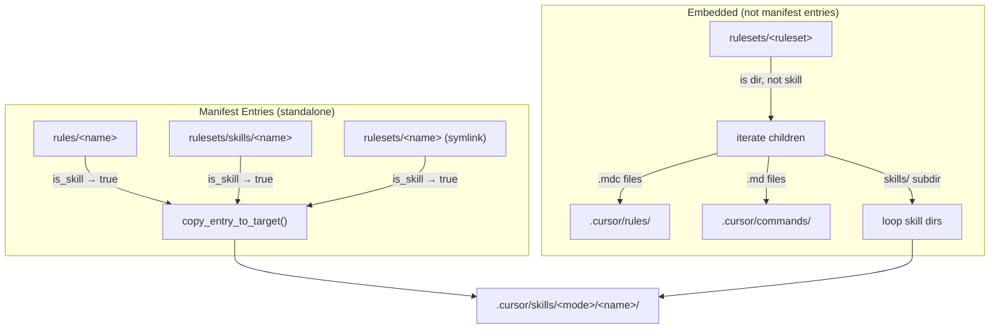

# Task: Skill Support

* Task ID: skill-support
* Complexity: Level 3
* Type: feature

Complete skill support in ai-rizz so that skill directories (containing `SKILL.md`) inside rulesets' magic `skills/` subdirectory are detected, deployed, and listed — alongside the three already-working detection paths.

## Pinned Info

### Skill Detection & Deployment Flow

All four skill detection paths converge on the same deployment target: `.cursor/skills/<mode>/`.

Key insight: Cases 1-3 (standalone) are already implemented. Case 4 (embedded in rulesets) is the gap — it requires changes in `copy_entry_to_target()` (deployment), `cmd_list()` (discovery + display), and `is_skill()` (detection for validation, though deployment of embedded skills doesn't require `is_skill()` — it's discovered by walking the `skills/` subdir).

## Component Analysis

### Affected Components

- **`is_skill()` (L245-318)**: Detects whether a manifest entry is a skill → needs `rulesets/<ruleset>/skills/<name>` case for completeness (validation use cases, not deployment-critical)
- **`copy_entry_to_target()` (L4520-4728)**: Copies entries to `.cursor/` targets → needs to discover and copy skill dirs from rulesets' `skills/` subdir during ruleset processing (analogous to existing `.md` command handling)
- **`cmd_list()` (L3386-3563)**: Discovers and displays skills + rulesets → needs (a) to discover skills in `rulesets/<r>/skills/<name>` for the "Available skills" section, and (b) to render `skills/` as a magic subdir in the ruleset tree (like `commands/`)

### Cross-Module Dependencies

- `copy_entry_to_target()` → `is_skill()`: Used for standalone skill detection; embedded skills don't go through `is_skill()` — they're discovered by directory walk
- `copy_entry_to_target()` → `get_skills_target_dir()`: Gets deployment path; already works, no changes needed
- `cmd_list()` → `is_skill_installed()`: Checks manifest entries for installed status; embedded skills show installed via their parent ruleset, not via their own manifest entry
- `sync_manifest_to_directory()` → `copy_entry_to_target()`: Sync calls CETT for each manifest entry; no changes needed in sync itself

### Boundary Changes

- `is_skill()` gains a new case but return contract unchanged ("true"/"false")
- `copy_entry_to_target()` ruleset branch gains new side-effect (copies to skills dir) but function signature unchanged
- `cmd_list()` gains new discovery source + tree rendering but output format unchanged

## Open Questions

None — implementation approach is clear. The `commands/` magic subdirectory pattern is already established and skills follows the same pattern exactly.

## Test Plan (TDD)

### Behaviors to Verify

**is_skill() detection:**
1. `rulesets/<ruleset>/skills/<name>` with `SKILL.md` → "true"
2. `rulesets/<ruleset>/skills/<name>` without `SKILL.md` → "false"
3. `rulesets/<ruleset>/skills/<a>/<b>` (nested) → "false" (no nesting allowed)
4. Existing cases still work (regression): `rules/<name>`, `rulesets/skills/<name>`, `rulesets/<name>` symlink

**copy_entry_to_target() deployment:**
5. Ruleset with `skills/<name>/SKILL.md` → skill dir copied to `.cursor/skills/<mode>/<name>/`
6. Ruleset with `skills/<name>/SKILL.md` + other files → all skill dir contents copied (not just SKILL.md)
7. Ruleset with no `skills/` subdir → no change in behavior (regression)
8. Ruleset with `skills/<name>` but no `SKILL.md` → NOT copied as skill
9. Ruleset with both `.mdc` rules and `skills/` → both deployed correctly
10. Ruleset with both `commands/` (.md) and `skills/` → all three types deployed correctly

**cmd_list() display:**
11. Skills inside `rulesets/<r>/skills/<name>` appear in "Available skills:" section
12. Skills inside rulesets show correct installed status (installed via parent ruleset)
13. Ruleset tree rendering shows `skills/` as magic subdir with expanded contents (like `commands/`)
14. Deduplication: skill in both `rules/<name>` and `rulesets/<r>/skills/<name>` shown once

### Test Infrastructure

- Framework: shunit2 (bundled)
- Test location: `tests/unit/`
- Conventions: `test_<description>()` functions; files `test_<feature>.test.sh`; source `common.sh` + `source_ai_rizz`; function-specific variable prefixes
- New test files:
  - `tests/unit/test_skill_detection.test.sh` — behaviors 1-4
  - `tests/unit/test_skill_sync.test.sh` — behaviors 5-10
  - `tests/unit/test_skill_list_display.test.sh` — behaviors 11-14

### Integration Tests

- No new integration test files needed; existing `test_cli_list_sync.test.sh` and `test_cli_add_remove.test.sh` cover the CLI surface. Unit tests are sufficient since the changes are internal to existing functions.

## Implementation Plan

### Step 1: Stub test files + stub `is_skill()` case

- Files: `tests/unit/test_skill_detection.test.sh`, `ai-rizz` (L245-318)
- Changes:
  - Create `test_skill_detection.test.sh` with test function stubs for behaviors 1-4
  - Add empty `rulesets/<ruleset>/skills/<name>` case in `is_skill()` (return "false" placeholder)

### Step 2: Stub `test_skill_sync.test.sh` + stub `copy_entry_to_target()` change

- Files: `tests/unit/test_skill_sync.test.sh`, `ai-rizz` (L4608-4723)
- Changes:
  - Create `test_skill_sync.test.sh` with test function stubs for behaviors 5-10
  - Add comment placeholder in `copy_entry_to_target()` ruleset branch for skills/ handling

### Step 3: Stub `test_skill_list_display.test.sh` + stub `cmd_list()` changes

- Files: `tests/unit/test_skill_list_display.test.sh`, `ai-rizz` (L3386-3563)
- Changes:
  - Create `test_skill_list_display.test.sh` with test function stubs for behaviors 11-14
  - Add comment placeholder in `cmd_list()` for ruleset-embedded skill discovery + tree rendering

### Step 4: Implement tests (all should fail)

- Files: All three test files
- Changes: Fill in test implementations with proper setup (create skill dirs, SKILL.md files) and assertions
- Run tests → all new tests should fail

### Step 5: Implement `is_skill()` — add `rulesets/<ruleset>/skills/<name>` case

- Files: `ai-rizz` (new case arm between L289 and L290)
- Changes: Add a **new case arm** `"${RULESETS_PATH}"/*/skills/*)` BEFORE the catch-all `"${RULESETS_PATH}"/*)` arm. This new arm:
  - Strips prefix to get `<ruleset>/skills/<name>`
  - Validates no further nesting (rejects `*/skills/*/*`)
  - Checks for `SKILL.md`
  - Returns "true"/"false"
- Variable prefix: `is_` (existing)
- Run detection tests → should pass

### Step 6: Implement `copy_entry_to_target()` — skills/ subdir handling in rulesets

- Files: `ai-rizz` (after L4723, within the directory/ruleset branch, after .md command handling)
- Changes: Add a new block analogous to the .md command handling:
  - Check if `${cett_source_path}/skills` directory exists
  - If yes, iterate its children: for each subdir that has `SKILL.md`:
    - Get skills target dir via `get_skills_target_dir()`
    - `mkdir -p` the skills target
    - `cp -rL` the skill dir to the target
  - Variable prefix: `cett_` (existing)
- Run sync tests → should pass

### Step 7: Implement `cmd_list()` — discovery + tree rendering

- Files: `ai-rizz` (L3386-3418 for discovery, L3506-3562 for tree rendering)
- Changes:
  - **Discovery (L3406 area)**: After the symlink discovery loop, add a new loop:
    - For each non-symlink directory in `rulesets/`, check if it has a `skills/` subdir
    - For each subdir of `skills/` that has `SKILL.md`, add to `cl_skill_names`
    - Skip if skill name already collected (deduplication happens at L3419 `sort -u`)
  - **Tree rendering (L3528 area)**: After the `commands/` special case, add a `skills/` special case with the same expanded rendering pattern
  - **Installed status**: Skills embedded in rulesets are "installed" when their parent ruleset is installed. The `is_skill_installed()` helper already checks `rulesets/<name>` entries. For embedded skills, we need to also check if any `rulesets/<r>` manifest entry contains this skill in its `skills/` subdir. Add this check to `is_skill_installed()`.
  - Variable prefix: `cl_` (existing)
- Run list tests → should pass

### Step 8: Full regression test suite

- Run `make test` → all tests (existing + new) should pass

## Technology Validation

No new technology — validation not required.

## Challenges & Mitigations

- **Deduplication in cmd_list**: A skill could exist both as `rules/<name>` (standalone) and inside `rulesets/<r>/skills/<name>`. The existing `sort -u` on `cl_skill_names` handles deduplication by name. Mitigation: rely on existing pattern, verify with test (behavior 14).
- **Installed status for embedded skills**: The `is_skill_installed()` helper checks manifest entries. Embedded skills don't have their own manifest entry — they're installed because their parent ruleset is. Mitigation: extend `is_skill_installed()` to also scan manifest rulesets for a matching `skills/<name>` subdir in the source repo.
- **POSIX variable scope**: New loops in `copy_entry_to_target()` must use `cett_` prefix consistently. Mitigation: follow established convention, review all variable names.

## Status

- [x] Component analysis complete
- [x] Open questions resolved
- [x] Test planning complete (TDD)
- [x] Implementation plan complete
- [x] Technology validation complete
- [x] Preflight
- [ ] Build
- [ ] QA
